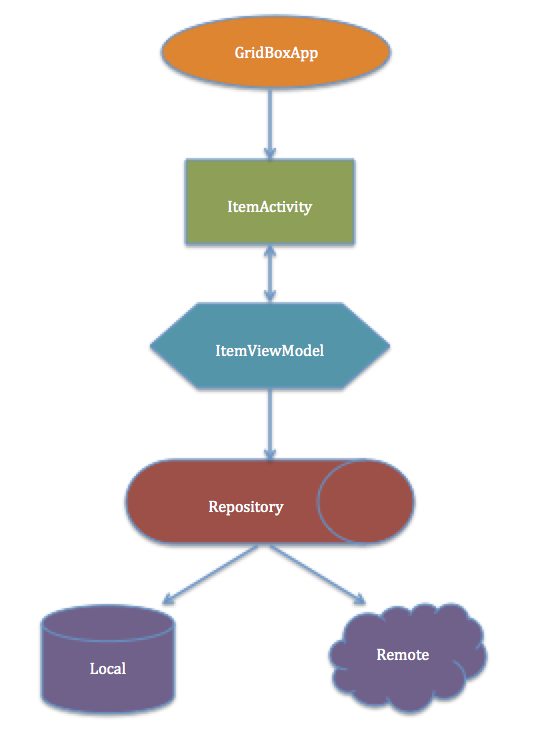

# GridBox

This project is an Android App which intents to implement the play full item gallery using gird layout, where item can be loaded from server or locally.

**Approach**

Following key points have been considered –
•	Architecture – MVVM
•	UI with animation
•	Reactive – RxJava2
•	API – Retrofit2 with okhttp3,
•	Dependency Injection – Dagger2
•	Picasso – Image loading

**MVVM Architecture** 

The project is logically divided into three modules.  Model, View and ViewModel.  

**Model** - The classes in the “repository” package represents the model and its helper classes to retrieve the model.  Here data is the content retrieved using the ItemAPI

**View** – All the classes in the “ui” package.  These are basically classes – ItemActivity, ItemGridView etc  These are meant for showing the data on UI.

**ViewModel** -  The classes in the “viewmodel” package are those classes which deals with the logic of retrieving the data and handing over to the registered view.  It encapsulates the details of how & from where to retrieve the data and helps the view to focus on showing the data.

With MVVM the code is structured, modularised and readable.

**Dependency Injection**

The dependency injection allows the inversion of dependency.  It allow loose coupling and plugable component approach.  DI in this project has been used to inject various moduels like Application, Activity, Item, ServerModule & OfflineModule with their scopes.

**Libraries**

Couple of well adapted libraries has been used in this project.  
•	RxJava2
•	Retrofit2
•	Okhttp3
•	Dagger2
•	ButterKnife
•	Picasso
•	Android support

**RxJava2** – For reactive flow of data.  Subscribe and observe the behaviour.

**Retrofit2 & OkHttp3** – Used to retrieve response for the given APIs

**Dagger2** – One of the best in practice currently for dependency injecction has been used to inject viewmodel to the activity.

**ButterKnife** – Used to bind android views and reduce the boiler place code.

**Android support libraries** – Card view, Appcompat etc.

**Point to note**

•	On start of application first time, the json data gets initialized in the internal storage file system. 
•	On second application start onwards, the json data gets read and updated from/to the internal storage file system.
•	Inorder to restore the original json content, clear the data of the app.
•	The IS_LOCAL flag in Constants.java controls the behaviour of loading the data from local or remote.
•	The offlineClient module mocks the server behaviour and return the response with status asynchronously.

**APP ARCHITECTURE - HIGH LEVEL**

